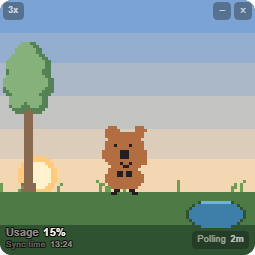
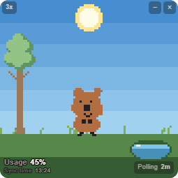
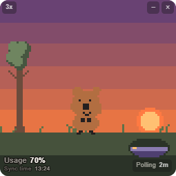
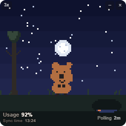

# Quokka HUD

**현재 Windows만 지원합니다 (macOS는 미검증).**

Claude 사용량을 데스크탑 위 작은 캐릭터로 보여주는 HUD입니다. 한도가 넉넉하면 해가 떠 있고 나무는 우거져 있으며, 사용량이 한 단계 늘 때마다 쿼카가 나무로 걸어가 잎을 한 장 뜯어 물고 연못으로 가서 물을 마십니다. 그만큼 나무는 성글어지고 연못 수위는 한 칸 내려갑니다. 다 쓰면 해가 지고 달이 뜨며 나무는 앙상해집니다. 맥의 RunCat이 CPU 사용률을 고양이가 뛰는 속도로 보여주듯, **숫자를 읽지 않아도 곁눈질만으로 상태가 들어오는 것**이 목표입니다.

---

## 스크린샷

| 아침 (62.5% 이상) | 낮 (37.5 ~ 62.5%) |
|---|---|
|  |  |

| 해질녘 (12.5 ~ 37.5%) | 밤 (12.5% 미만) |
|---|---|
|  |  |

---

## 실행 조건

이 앱은 **스스로 로그인하지 않습니다.** 이미 설치된 Claude Code CLI에게 사용량을 물어보는 방식이라, 아래 조건이 갖춰져 있지 않으면 값을 읽지 못합니다.

### 1. Claude Code CLI 설치 및 로그인 (필수)

```bash
npm install -g @anthropic-ai/claude-code
claude          # 처음 실행 시 로그인 안내를 따릅니다
```

터미널에서 아래가 사용량을 출력하면 준비된 것입니다.

```bash
claude -p "/usage"
```

### 2. 구독 요금제 계정

Pro·Max 같은 **구독 요금제** 계정을 기준으로 만들었습니다. `/usage`가 5시간 창과 주간 한도를 백분율로 알려주기 때문입니다.

API 크레딧 전용 계정은 `/usage` 출력 형식이 다를 수 있고, 그 경우 파싱이 실패해 화면이 갱신되지 않습니다.

### 3. WebView2 (Windows)

Windows 11은 기본 포함. Windows 10에서는 설치 프로그램이 필요 시 자동으로
내려받아 설치합니다(인터넷 연결 필요). 자동 설치가 되지 않으면
Microsoft에서 [WebView2 Evergreen 런타임](https://developer.microsoft.com/microsoft-edge/webview2/)을 직접 설치해 주세요.

### 모델 종류는 무관합니다

Opus든 Sonnet이든 상관없습니다. `/usage`는 슬래시 명령이라 모델을 부르지 않고, 이 앱의 조회 자체는 사용량에 계산되지 않습니다.

---

## 설치 및 실행

아직 배포용 설치 파일이 없어 소스에서 빌드합니다.

### 빌드 도구 준비 (최초 1회)

Windows 기준입니다. 관리자 권한 PowerShell에서:

```powershell
winget install Rustlang.Rustup                          # Rust 툴체인
winget install OpenJS.NodeJS.LTS                        # Node.js LTS
winget install Microsoft.VisualStudio.2022.BuildTools   # MSVC 링커
```

> **Build Tools는 설치 후 Visual Studio Installer를 열어 "C++를 사용한 데스크톱 개발" 워크로드를 체크해야 합니다.** winget 설치만으로는 링커가 들어오지 않아 첫 빌드에서 실패합니다.

새 터미널에서 확인:

```powershell
rustc --version
node --version
```

### 빌드

```bash
git clone https://github.com/Jinyoung0318/quokka-hud.git
cd quokka-hud
npm install

npm run tauri build -- --no-bundle   # 실행 파일만 (약 2분)
```

`src-tauri/target/release/quokka-hud.exe`가 만들어집니다.

설치 패키지(MSI·NSIS)까지 필요하면 `--no-bundle`을 빼면 됩니다. 대신 6분 남짓 걸립니다.

### 개발 모드

```bash
npm run tauri dev     # 창을 띄우고 핫 리로드
npm run dev           # 브라우저에서 화면만 (창 기능 제외)
```

브라우저로 열면 프로세스를 띄울 수 없어 목 데이터로 돕니다. 개발 서버에 붙여둔 `/__dev/usage` 엔드포인트를 통해 실제 CLI 값을 받아볼 수도 있습니다. 개발용 패널에서 실제 CLI / Mock을 오갈 수 있습니다.

---

## 사용법

창은 테두리 없는 정사각형이고 항상 위에 뜹니다.

| 조작 | 하는 일 |
|---|---|
| **창 아무 데나 드래그** | 창 이동. 버튼 위만 아니면 어디든 잡힙니다 |
| **타이틀바 왼쪽 배율 버튼** | 누를 때마다 1배 → 2배 → 3배 → 1배 순환 |
| **오른쪽 아래 `Polling` 버튼** | 사용량을 몇 분마다 조회할지. 1분 → 2분 → 5분 순환 |
| **타이틀바 − ×** | 최소화 · 닫기 |
| **트레이 아이콘 우클릭** | 크기(작게·보통·크게) · 갱신 주기(1·2·5분) · 설정(준비 중) · 종료 |

창 크기와 위치는 종료해도 남아서 다음에 켤 때 그 자리에 그대로 뜹니다.

배율은 논리 해상도 85px의 정수배입니다.

| 배율 | 창 크기 | |
|---|---|---|
| 1배 (작게) | 85 × 85 | 구석에 두는 표시등 |
| 2배 (보통, 기본) | 170 × 170 | |
| 3배 (크게) | 255 × 255 | 씬을 들여다볼 때 |

타이틀바와 숫자 표시도 배율을 따라 줄어듭니다. 고정 크기로 두면 큰 창에 맞춘 버튼이 작은 창을 다 덮습니다.

**1배(85 × 85)에서는 줄이는 대신 접습니다.** 창 버튼은 감춰두고 창에 마우스를 올렸을 때만 나타나며, 숫자는 라벨과 갱신 시각을 빼고 `16%` 만 남습니다. 이 크기에서는 숫자를 읽는 것보다 해가 떠 있는지 져 있는지가 중요합니다.

---

## 화면 읽는 법

> **표시되는 사용량은 이 기기의 로컬 세션 기준이며, 다른 기기나 claude.ai에서 쓴 건 포함되지 않습니다.**
> CLI가 `/usage` 출력에 직접 명시하는 조건입니다.

왼쪽 아래에 정확한 사용량과 마지막 갱신 시각이, 오른쪽 아래에 갱신 주기가 글자로 뜹니다. 그 위의 그림은 **네 단계로 스냅해서** 보여줍니다.

| 잔여율 | 하늘 | 나무 (수관) | 연못 (수위) |
|---|---|---|---|
| **62.5% 이상** | 해가 낮게 · 맑음 | 가장 풍성 | 가득 (4칸) |
| **37.5 ~ 62.5%** | 해가 가장 높음 | 조금 성글게 | 3칸 |
| **12.5 ~ 37.5%** | 해가 지평선으로 · 붉은빛 | 더 성글게 | 2칸 |
| **12.5% 미만** | 달과 별 | 앙상함 | 1칸 |

세 요소가 같은 값을 서로 다른 방식으로 보여줍니다.

- **해와 하늘** — 화면 전체를 물들이는 큰 인상. 곁눈질로도 시간대가 들어옵니다
- **유칼립투스** — 분위기. 잎을 세지 않고 수관이 통째로 커지고 작아지기만 합니다
- **연못** — 정확한 잔여량. **세는 일은 연못 하나만 맡습니다.** 나무까지 개수로 세게 하면 읽을 것이 둘로 늘어납니다

밤에도 수관과 수위를 0으로 만들지 않습니다. 0이면 한도가 리셋될 때 나무와 연못이 한꺼번에 되살아나 부자연스럽기 때문입니다.

---

## 어떻게 동작하는가

### 값을 어디서 가져오나 — 그리고 왜 이 방법인가

5분마다 `claude -p "/usage"`를 실행해 stdout을 파싱합니다.

```
You are currently using your subscription to power your Claude Code usage
Current session: 51% used · resets Aug 27, 1pm (Asia/Seoul)
Current week (all models): 5% used · resets Sep 2, 8pm (Asia/Seoul)
```

우회로처럼 보이지만 **이것이 현재 유일하게 안전한 경로입니다.**

개인 구독의 한도를 조회하는 공식 API가 없습니다. 그렇다고 직접 인증을 구현하면 로그인 폼을 만들거나 `~/.claude/.credentials.json` 같은 토큰 파일을 읽어야 하는데, 남의 자격증명을 대신 들고 있는 프로그램은 만들지 않는 편이 맞습니다. 비공식 엔드포인트를 직접 두드리는 것도 같은 이유로 피했습니다.

그래서 **인증은 이미 로그인해 둔 공식 클라이언트에게 맡기고, 이 앱은 그 클라이언트에게 물어보기만 합니다.** 토큰을 만지지도, 저장하지도, 네트워크로 보내지도 않습니다.

`/usage`는 슬래시 명령이라 모델을 호출하지 않습니다. 조회 자체가 사용량을 깎지 않는 것을 확인했습니다(요청 수 322 → 322).

수집기는 환경에 따라 갈립니다.

```
Tauri 창  →  Rust가 프로세스를 띄우고 원문만 프론트로 넘김
Node      →  child_process 로 직접 실행
브라우저   →  개발 서버 경유, 실패하면 목 데이터
```

파싱은 **한 곳(TypeScript)에만** 둡니다. Rust는 원문만 넘깁니다. 파서를 양쪽에 두면 둘이 조용히 어긋나기 때문입니다.

실패하면 마지막 성공 값을 그대로 들고 `stale` 표시만 세웁니다. 캐릭터가 멈추면 고장난 것처럼 보입니다. 연속 실패에는 10분 → 20분 → 30분으로 주기를 늘리고, 한 번이라도 성공하면 곧바로 5분으로 돌아옵니다.

### 궤도 기반 상태 시스템 — 해는 절대 역주행하지 않는다

해의 위치를 각도가 아니라 **단조 증가하는 실수 하나**로 관리합니다. 네 단계가 한 바퀴이고(`morning`=0, `noon`=1, `dusk`=2, `night`=3), 이 값은 오직 증가만 하며 한 바퀴를 넘으면 감깁니다.

목표를 정할 때 **순방향 거리만** 계산합니다.

```ts
const diff = phaseIndex - position;
return ((diff % PHASE_COUNT) + PHASE_COUNT) % PHASE_COUNT;
```

이 한 줄에서 두 가지가 동시에 나옵니다.

- **값이 내려가면** (75 → 50) 다음 단계로 한 칸 전진
- **값이 올라가면** (0 → 75) 리셋. 되감지 않고 남은 밤을 마저 지나 **한 바퀴를 완주해** 아침에 도착

한도가 리셋됐다고 해가 거꾸로 서쪽에서 동쪽으로 돌아가면 이상합니다. 순방향만 계산하면 그런 경로가 애초에 만들어지지 않습니다.

소비냐 리셋이냐는 수관 단계를 비교해서 가릅니다. 궤도 거리로는 구분할 수 없습니다 — 밤→아침도 아침→낮도 궤도로는 똑같이 한 칸 전진이기 때문입니다.

전환 중에 값이 또 바뀌어도 **쿼카는 순간이동하지 않습니다.** 지점을 이름(`tree`/`home`/`pond`)이 아니라 수직선 좌표(나무 0, 가운데 1, 연못 2)로 다뤄서, 구간 한가운데서 갈아타도 지금 자리를 그대로 넘겨줍니다. 잎을 이미 들고 있으면 들고 있는 채로 연못 구간부터 이어갑니다.

### 85×85 논리 해상도를 정수배로 확대

캔버스는 **85×85**로 그리고 CSS로 정수배 확대합니다. 배율이 정수라야 픽셀 경계가 흐려지지 않습니다.

```
canvas.width = 85          →  CSS 170px (2배)
ctx.imageSmoothingEnabled = false
image-rendering: pixelated
```

`ctx.arc()` 같은 path 렌더링은 `imageSmoothingEnabled`와 무관하게 가장자리가 안티앨리어싱됩니다. 확대하면 그 흐릿함이 그대로 보이므로 **원도 1×1 사각형을 찍어서** 만듭니다.

같은 이유로 잔여율 숫자는 캔버스 밖에 있습니다. 캔버스 안에 3×5 픽셀 폰트로 찍어봤지만 4배로 키우니 소문자가 뭉개져 읽히지 않았습니다. 지금은 캔버스 위에 HTML을 겹치고 `text-shadow`로 외곽선을 둘러 어떤 배경에서도 읽히게 했습니다.

---

## 알려진 제약

- **코드 서명이 없습니다.** 처음 실행할 때 Windows SmartScreen이 경고를 띄웁니다. `추가 정보` → `실행`으로 넘길 수 있습니다. 서명 인증서가 없어 당분간 이대로입니다
- **`/usage` 출력 형식이 바뀌면 파싱이 깨집니다.** 공식 API가 아니라 CLI 출력을 읽는 방식의 태생적 한계입니다. 깨지면 화면이 마지막 값에서 멈추고 `stale` 표시가 붙습니다
- **갱신은 주기적이며 실시간이 아닙니다.** 1분 · 2분 · 5분 중에서 고르고 기본값은 2분입니다. 조회 한 번에 CLI 부팅을 포함해 7초쯤 걸립니다 — 1분 주기면 그 시간의 12% 동안 CLI 프로세스가 떠 있는 셈이라, 고를 수는 있게 하되 기본값은 2분으로 두었습니다
- **다른 기기에서 쓴 사용량은 잡히지 않습니다.** 이 기기의 로컬 세션만 셉니다. 노트북과 데스크톱을 오가며 쓴다면 실제보다 적게 나옵니다
- **CLI가 없거나 로그인이 안 되어 있으면 안내 화면이 뜹니다.** 무엇이 문제인지와 어떻게 고치는지를 창에 띄웁니다. 실패 원인은 앱 데이터 폴더의 `diagnostics.log`에 최근 20건까지 남습니다
- **조회에 실패해도 마지막 값을 유지합니다.** 화면이 비지 않는 대신, 표시된 값이 지금 값이 아닐 수 있습니다. 그때는 숫자 옆에 점이 붙습니다
- **Windows 전용입니다.** macOS·Linux용 빌드는 제공하지 않습니다. Tauri 기반이라 원리상 다른 OS에서도 동작할 가능성은 있지만, 개발·검증 모두 Windows에서만 했고 다른 OS로 빌드해본 적이 없습니다

---

## 기술 스택

| 영역 | 선택 |
|---|---|
| 프레임워크 | Tauri v2 (Rust 백엔드 + WebView 프론트엔드) |
| 프론트엔드 | Vanilla TypeScript + Vite — 프레임워크 없이 |
| 렌더링 | Canvas 2D, 85×85 논리 해상도 |
| 데이터 취득 | Claude Code CLI 프로세스 호출 → stdout 파싱 |

의존성을 거의 두지 않았습니다. 화면 전체가 캔버스 한 장이고 상태는 값 몇 개라, UI 프레임워크가 할 일이 없었습니다.

## 프로젝트 구조

```
src/
├── collector/     사용량 취득 — CLI 호출과 출력 파싱, 5분 폴링·백오프
├── state/         잔여율 → 궤도 위치 → 전환 연출
├── render/        캔버스 렌더 — 하늘·해·달·별·나무·연못·풀·스프라이트
├── sprites/       캐릭터 스프라이트 (문자 배열 또는 PNG)
├── overlay/       캔버스 위에 겹치는 HTML 표시
├── titlebar/      커스텀 타이틀바 (최소화·닫기·배율)
└── dev/           개발용 도구 — 이 폴더를 통째로 지워도 앱은 돈다

src-tauri/src/
├── collector/     claude CLI 실행 (원문만 넘기고 파싱은 안 함)
├── scale.rs       창 배율
├── settings.rs    배율·위치 저장
└── tray.rs        트레이 아이콘과 메뉴
```

설계 원칙 몇 가지를 지켰습니다.

- **수집기와 렌더러를 분리합니다.** 렌더러는 `UsageSnapshot` 하나만 보고 값이 어디서 왔는지 모릅니다
- **CLI 호출은 한 곳에 격리합니다.** 취득 경로가 바뀌어도 그 모듈만 교체하면 됩니다
- **상태 계층은 화면 좌표를 모릅니다.** "어느 지점에 있는가"만 정하고 픽셀 위치는 렌더 쪽이 정합니다
- **개발용 코드는 `src/dev/`에 모읍니다.** 폴더를 지우고 `main.ts`의 표시된 몇 줄만 걷어내면 됩니다

더 자세한 설계 결정과 그 이유는 [CLAUDE.md](CLAUDE.md)에 있습니다.

---

## 라이선스

[MIT](LICENSE)
